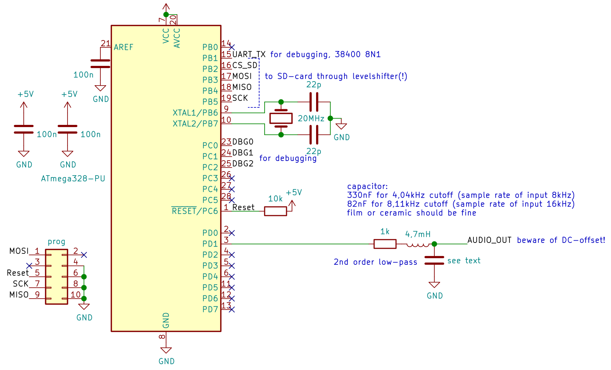

# mega328-pdm-audio

## What is this?
This code makes an ATmega328P play audio from an SD-card (with or without a filesystem like [kittenFS32](https://github.com/kittennbfive/kittenFS32)). It uses PDM through the (abused) USART-interface in SPI mode. The audio quality is good enough for voice and even "low-fi" music.

## Licence and disclaimer
The content of this repo is provided under AGPLv3+ and WITHOUT ANY WARRANTY! It is experimental stuff!

## There is a typo, you mean P_W_M!
No, i don't. PDM is short for *pulse-density modulation*, not to be confused with the much more known *pulse-width modulation* or short PWM.

## What the heck is this thing "PDM"?
Well, if you really dig into it becomes really complicated. The basic idea for P**W**M is to have a square wave with constant frequency and vary the duty-cycle to produce a sound after lowpass-filtering. PDM uses short pulses of constant length and adjusts the number/density of pulses to produce the audio signal (after lowpass-filtering again). PDM is related to ΣΔ-ADC and DAC technology. Wikipedia explains it better than me: https://en.wikipedia.org/wiki/Pulse-density_modulation You can also look into *Art Of Electronics 3* chapter 13.9 for quite a bit of text, but as i said, it's complex.

## Keep it simple! Why not use PWM?
The problem is speed. The ATmega328P can run from a 20MHz crystal at most (probably even a little more but not much). Using the 8 bit Timer0 in "Fast PWM Mode" the maximum frequency of the timer is f_cpu/256 or about 78kHz. For 8 bit resolution you would get 78000/(2\**8) or a little more than 300Hz of playback-frequency - that's *way* too low to output any audio (remember Shanon-Nyquist).  
A solution would be to use an AVR like the ATtiny85 with its internal 64 MHz PLL that can directly clock Timer1 to get sufficient speed for audio, but the t85 is quite small in terms of pins and memory. There might be other, better suited AVR (and of course the bigger boys like STM32 etc), but the chip shortage is still ongoing and using "dedicated" hardware like a high-speed Timer/PLL and/or a beefier microcontroller would be to easy, wouldn't it? :-)

## How does your stuff work? / What does it do?
Well, as i said the basic idea of PDM is to output short digital pulses with the relative density of the pulses corresponding to the analog value we want to produce. To get decent quality for a maximum audio frequency of f_s you need an output frequency of 2\*f_s\*OSR with OSR being the "oversampling ratio" (and the factor 2 being due to Shanon-Nyquist). Depending on order of the *modulator* you use to convert your audio you will need an OSR of at least 16 to get effective 8 bit resolution at the output (see AoE3 figure 13.56 on page 929). Higher OSR is better but we are limited by our AVR. The ATmega328P contains this nice peripheral called USART that can be used for standard UART (boring!) or in SPI-master-mode with a clock as high as f_cpu/2=10MHz. Also it is double-buffered, so it can be used to output a *continuous* stream of 0 and 1. I already (ab)used this to [connect an I2S-mic](https://github.com/kittennbfive/avr-i2s) to an ATmega328P. With an OSR of let's say 32 the USART @10MHz would give you a theoretical playback-frequency of about 312kHz or (Shanon-Nyquist again) about 150kHz bandwidth! *However* you need to feed the data into the USART fast enough too and this data has to come from somewhere, because the ATmega328P has really limited internal memory (if we are talking audio at least). So we need to use something like an external FLASH or - in my case - an SD-card.

## How is the performance?
Actually it's surprisingly good. Obviously it is not suitable for high-fidelity audio but for voice and even some music (like ringtones, ...) it's fine.  
With kittenFS32 and a decent SD-card (Sandisk) the limit is an OSR of 48 for 8kHz sampling rate or an OSR of 26 for 16kHz sampling rate.  
With the data directly imaged to the SD-card (no file system) you can get to OSR 70(!) for 8kHz or OSR 35 for 16kHz.  
The exact values will depend on how well your avr-gcc optimises and how fast your SD-card is. With a cheap no-name card i could not go as high as stated here.

## Downsides / Limitations?
- This code uses only a fraction of the FLASH but most of the RAM and available processing power of the ATmega328P. Don't expect it to do other work while playing audio. The code uses an interrupt that fires at a fairly high rate to feed the USART and the main-loop is busy getting new data from the card.
- The output is mono only.
- The generated "audio"-files are quite big (depending on OSR) and can't be compressed easily, but storage is cheap nowadays. As a ballpark figure, a music file of 4 minutes 50 seconds is 28,9MB with OSR 26... The size does not depend on the content of the file as there is no fancy compression going on.

## What is inside this repo?
There are 2 main parts:
- A piece of software called pdmconv for converting a wave-file into what i call a "packed PDM"-file.
- Code for the ATmega328P that shows how to play those files. For maximum comfort you can use regular files on a FAT32-formated SD-card or - for maximum performance - there is some code that expects the SD-card to contain the raw-data directly (the output of pdmconv is used as a raw device image to be `dd`-ed onto the SD-card).

## The converter: pdmconv
This tool is written in C and for Linux only, tested on Debian 11. You might somehow get it to compile/work on Windows too but i won't and can't provide any support for this.
### How to compile?
Just use GCC: `gcc -Wall -Wextra -Werror -o pdmconv pdmconv.c`. No external dependencies. Caution: -O2 or -O3 breaks the code (on Debian 11 at least), see comment at top of file.
### Usage
```
usage: pdmconv --osr $osr infile.wav outfile

$osr is the oversampling ratio, higher means better quality.
Input wave file must be single channel 16 bit signed PCM with 8kHz or 16kHz sampling rate.
Output file can be transfered to formated SD-card as a regular file or written as raw image using dd.
Warning: An existing file will be overwritten!
Please read the documentation.
```
### Input file format
The input file must be a wave file containing a single channel of plain, uncompressed PCM as signed 16 bit integers and with a sample rate of 8kHz or 16kHz. If you have let's say an .ogg you can use sox to convert your file to a suitable format, for example `sox nice_music.ogg -r 16k -b 16 -e signed nice_music_converted.wav remix 1`. The `remix 1` means that sox will only use the left channel of the stereo input file. If you get warnings about clipping try adding something like `gain -3` (in dB) before `remix`. For more details refer to the documentation and/or man-page of sox.
### How does it work?
Most of the code is straightforward. There is some command line argument parsing using getopt, than the input wave file is read, some checks are performed (like is this plain PCM, mono, ...) and the actual audio-data is copied into malloc'ed memory. The size of the output file is calculated and memory for the data is allocated. The real magic happens inside the for()-loop that implements a second-order-modulator as described in AoE3 (figure 13.55 page 929). The modulator will create a nasty glitch on the generated audio so a certain number of samples at the beginning is thrown away. Finally the converted data is written to the output file. The tool also calculates the correct value for the UBBR-register of the AVR, this value depends on OSR and sampling rate of the input file (and clock of the AVR assumed to be 20MHz) and must be modified in the AVR-code.

## The hardware

  
The ATmega328P is configured for external 20MHz crystal (E:FF H:D9 L:E7). It needs to run on 5V for this clock frequency.  
*Don't forget that SD-cards only accept 3,3V; you will need a voltage regulator and some level shifter for chip-select and the SPI-bus or you will fry your card!* I used a ready-made module that contains everything.  
Also keep in mind that the filtered audio output has quite a big DC-offset, you may need a DC-blocker (a simple capacitor should do) depending on what kind of amplifier/... you want to connect the signal to!  
If you change the sample rate of your file you need to modify the lowpass filter, see schematic.

## The firmware

### with file system
The current code will play PDM.BIN (in uppercase!) from the root-directory of the card (specifically formated for kittenFS, please see documentation there).
#### How to use?
You need to adjust the UBBR-value in the code depending on the selected OSR and the sample rate of the input audio file. Just copy the value calculated by pdmconv. Of course you also need to copy the output of pdmconv, renamed to PDM.BIN, to the *correctly formatted* SD-card (please read the documentation of kittenFS32).  
Currently the code will only play a single file once and then stop. It is not a full-blown music player but rather a proof-of-concept.

### without file system
#### How to use?
First you need to adjust the UBBR-value depending on the selected OSR and the sample rate of the input audio file. Just copy the value calculated by pdmconv. You also need to adjust the number of sectors of the PDM-data (value displayed by pdmconv too).  
Currently the code will only play the file once and then stop. It is not a full-blown music player but rather a proof-of-concept.

### How to compile/flash?
Execute `./make_avr` (Yes i *still* don't know makefiles...) and flash using your favourite tool, for example avrdude. Beware that you probably need to disconnect the SD-card (or at least MISO) from the SPI-bus to be able to flash.

### Debug output(s)
As the USART is used for the audio output i wrote a quick and dirty [software UART](https://github.com/kittennbfive/software-UART-TX) that outputs some status information on pin PB1. Note the somewhat unusual baudrate: 38400 8N1. There is no RX, only TX. Pins PC0-2 are configured as outputs to check timing and stuff using a scope. You can savely remove the corresponding code.

### A note about RAM usage
If you want to modify/improve the code please keep in mind that there is not much RAM (total 2kB available on the ATmega328P) left. The code uses 2 buffers of 512 bytes each for buffering the data from the SD-card and kittenFS32 uses another internal buffer of the same size, plus some other variables and the stack and... If your code crashes or the AVR is doing weird things double-check your RAM usage! I choose 512 bytes on purpose because it corresponds to a sector of the SD-card, a smaller or bigger (impossible because of limited RAM) value would mean reading accross sector-boundaries, that would (probably) slow down things.
